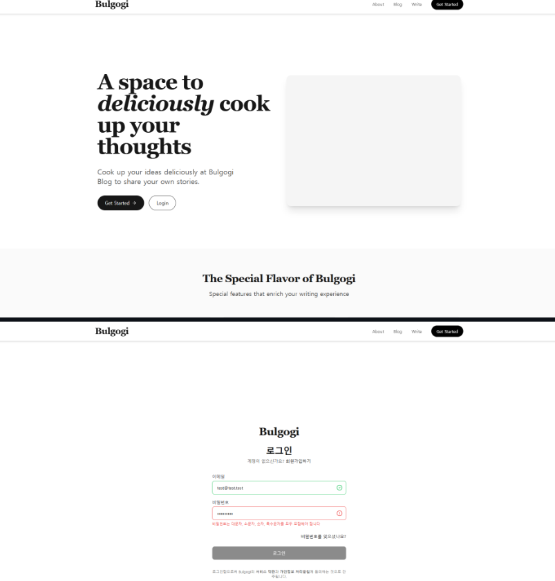
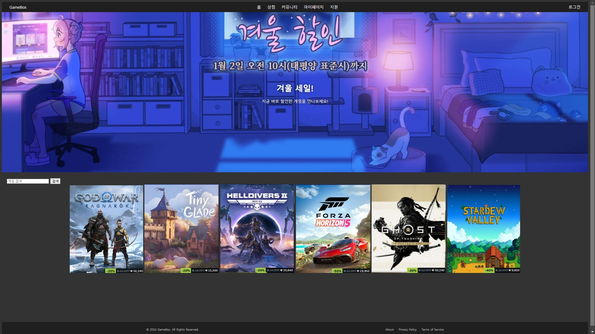
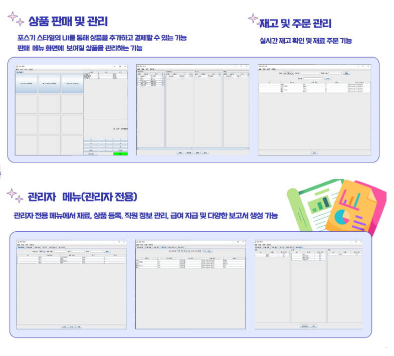

# 웹 개발자 김금구 이력서

------

[이름] 김금구  
[연락처] 010-4966-8118  
[이메일] rmarn018@gmail.com  
[GitHub] https://github.com/kumugu  

### 자기소개

견고하고 안정적인 시스템을 만드는 데 가치를 두는 개발자 김금구입니다. 
개발을 시작하며 가장 인상 깊었던 점은, 우리가 일상에서 당연하게 사용하는 서비스들조차 그 이면에는 수많은 고민과 설계, 문제 해결이 숨어 있다는 것이었습니다.

사용자에게 편안한 경험을 제공하려면, 눈에 보이지 않는 백엔드 시스템이 견고하고 안정적이어야 한다고 생각합니다. 
저는 이러한 시스템을 설계하고 구현하는 데 흥미를 느끼며, 이를 통해 사용자, 비즈니스, 개발자 모두가 만족할 수 있는 결과를 만들어내는 것을 추구합니다.

안정적인 시스템은 곧 신뢰이며, 신뢰는 서비스의 지속가능성과도 연결된다고 믿습니다. 
그래서 저는 작은 기능 하나를 구현하더라도 '왜'라는 질문을 놓지 않으며, 기술적 완성도뿐만 아니라 고객과 회사의 가치를 함께 고려하는 개발자가 되고자 합니다.

------

### 기술스택

- **Backend**: Java, Spring Boot, JPA, Spring Security, JWT
- **Frontend**: React, TypeScript, Zustand, Tailwind CSS
- **Database**: MySQL, Redis
- **DevOps & Tools**: Docker, AWS EC2/S3, Git, Postman

------

### 주요 개인 프로젝트

#### 블로그 플랫폼 서비스 (PJ_Bulgogi)
[GitHub] https://github.com/kumugu/PJ_Bulgogi/

- **기간**: 2025.03 ~ 2025.04
- **소개**: 사용자 인증과 게시글 작성을 지원하는 블로그 플랫폼
- **주요 기능**:
  - 회원가입, 로그인 및 프로필 수정
  - 게시글 CRUD, 이미지 업로드 (S3)
  - JWT 인증 및 상태 관리 (Zustand)
  - Redis를 통한 조회수 처리 최적화
- **기술 스택**: Spring Boot, React, MySQL, Redis, AWS, Docker

#### 게임 쇼핑몰 웹 서비스 (PJ_GameBox)
[GitHub] https://github.com/kumugu/PJ_GameBox

- **기간**: 2024.12 ~ 2025.01
- **소개**: JSP 기반 게임 쇼핑몰 플랫폼
- **주요 기능**:
  - 사용자 관리 (회원가입/로그인, 권한 분리)
  - 게임 상점: 검색, 장바구니, 구매, 리뷰
  - 커뮤니티: 게시판, 토론 기능
  - 관리자 페이지: 게임/리뷰/게시글 관리
  - 마이페이지, 고객지원 기능
- **기술 스택**: Java, JSP/Servlet, MySQL, JSTL

#### 매장 관리 애플리케이션 (PJ_Burger-Shop)
[GitHub] https://github.com/kumugu/PJ_Burger-Shop/

- **기간**: 2024.11 ~ 2024.12
- **소개**: Java Swing을 활용한 오프라인 버거샵 관리 프로그램
- **주요 기능**:
  - POS UI 구성
  - 주문/재고 관리
  - 사용자 권한 및 매출 통계
- **기술 스택**: Java Swing, JDBC, Oracle

---

